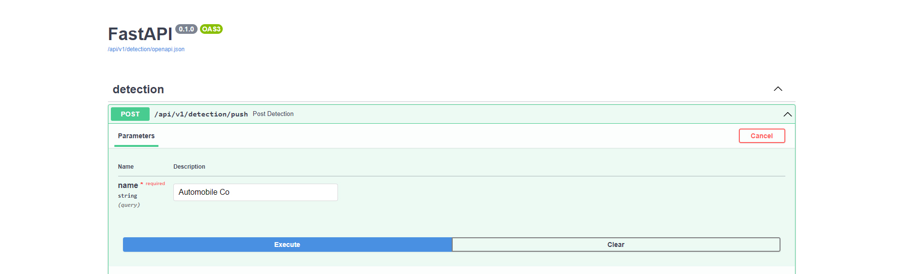
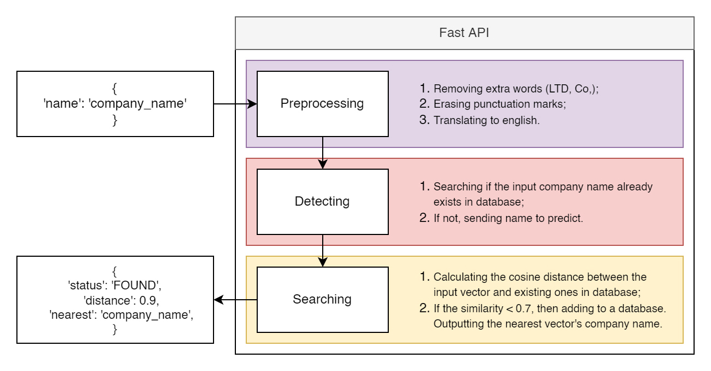

<h1 align="center">Text comparison</h1>

The project is made as part of a deep learning course at ITMO University. 
The goal is to use an NLP model to find a company name, which was given as an input, in a database, containing a list of company names.
If there is none, the company name should be added into the database as a new one.

<p align="center"></p>
<p align="center">Screenshot of a <a href="https://github.com/arthurkazaryan/licence_plate_detection/tree/main/database_project">web-service</a></p>

<hr>
<h2>Dataset overview and preprocessing</h2>
The dataset is represented as a csv-file containing 497819 pairs of company names with a tag whether they are equal or not.

<br>
<table style="margin:0px auto;">
<tr>
    <th>Company 1</th>
    <th>Company 2</th>
    <th>Is equal</th>
</tr>
<tr>
    <td>Iko Industries Ltd.</td>
    <td>Enormous Industrial Trade Pvt., Ltd.</td>
    <td>0</td>
</tr>
<tr>
    <td>Apcotex Industries Ltd.</td>
    <td>Technocraft Industries (India) Ltd.</td>
    <td>0</td>
</tr>
<tr>
    <td>BIT-MAT PRODUCTS</td>
    <td>The Goodyear Tire and Rubber Company</td>
    <td>0</td>
</tr>
</table>

<p align="center">Sample of a given dataset</p>

Unequal samples are represented as 99.3% out of all rows and only 0.7% represented as equal samples.

<h3>Preprocessing</h3>
Before vectorizing a company name, there are some preprocessing steps required to be done:
<ul>
<li>removing extra words (Ltd, Pvt, Co);</li>
<li>erasing puctuation marks;</li>
<li>translating to english.</li>
</ul>

<table style="margin:0px auto;">
<tr>
    <th>Before</th>
    <th>After</th>
</tr>
<tr>
    <td>COMPANY NAME</td>
    <td>COMPANY NAME</td>
</tr>
<tr>
    <td>COMPANY NAME</td>
    <td>COMPANY NAME</td>
</tr>
<tr>
    <td>COMPANY NAME</td>
    <td>COMPANY NAME</td>
</tr>
</table>

<p align="center">An example of preprocessed company names</p>

<hr>
<h2>Model selection</h2>
For vectorizing a company name several models were chosen:
<ul>
<li>BERT;</li>
<li>LaBSE;</li>
<li>MiniLM;</li>
<li>Distiluse;</li>
<li>FuzzyWuzzy.</li>
</ul>

Each of the models were tested on a given dataset the metrics score are:

<br>
<table style="margin:0px auto;">
<tr>
    <th>Model</th>
    <th>F1</th>
    <th>Gini</th>
    <th>Accuracy</th>
    <th>Precision</th>
    <th>Recall</th>
</tr>
<tr>
    <td>BERT</td>
    <td>-</td>
    <td>-</td>
    <td>-</td>
    <td>-</td>
    <td>-</td>
</tr>
<tr>
    <td>LaBSE</td>
    <td>-</td>
    <td>-</td>
    <td>-</td>
    <td>-</td>
    <td>-</td>
</tr>
<tr>
    <td>MiniLM</td>
    <td>-</td>
    <td>-</td>
    <td>-</td>
    <td>-</td>
    <td>-</td>
</tr>
<tr>
    <td>Distiluse</td>
    <td>-</td>
    <td>-</td>
    <td>-</td>
    <td>-</td>
    <td>-</td>
</tr>
<tr>
    <td>FuzzyWuzzy</td>
    <td>0.045</td>
    <td>0.714</td>
    <td>0.741</td>
    <td>0.023</td>
    <td>0.828</td>
</tr>
</table>

<hr>
<h2>Fast API based service for text comparison</h2>

<h3>Installation</h3>

```
conda create -n text_comparison python=3.7
conda activate text_comparison
pip install -r requirements.txt
```

<h3>Launching</h3>

```
conda activate text_comparison
python launch_api.py
```

Аfter launching it can be accessed at: ``http://localhost:7761/api/v1/detection/docs``

<h3>Accessing</h3>

<p align="center"></p>
<p align="center">Screenshot of an API service</a></p>
<br>

API can be used via interface or by sending request using only ``name`` parameter:


```
import requests

request_data = {'name': 'company_name'}

request = requests.post('http://localhost:7761/api/v1/detection/push', params=request_data).json()

print(request['status'], request['distance'], request['nearest'])
```

<p align="center"></p>
<p align="center">Scheme of an API service</a></p>
<br>
